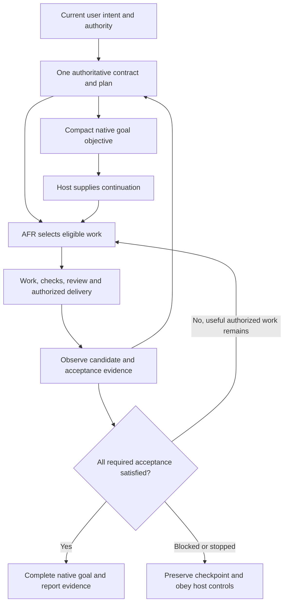

# Native goals, GPT-6 prompting, and structured AFR execution

**Research date:** 2026-09-27. **Repository baseline:** `596fa519d44e9c901e0dbffdae14bddbfe018909`.
**Status:** research and recommendations; no change to AFR's operating instructions or qualification status.

## Assessment

AFR's `/goal` integration is **architecturally sound and conservative about authority, but not yet demonstrated to produce consistent goal-on execution**. Its strongest features are a single parent objective, a compact projection of the authorized contract, evidence-based completion, prerequisite ordering, and preservation of ordinary goal-off operation. The main opportunities are clearer goal-selection guidance, an explicit goal-plus-plan execution pattern, current control examples, and completion of the existing native qualification work.

The session's native controls largely fit AFR's design. There is one material observation to refresh: this session exposes agent-requested `paused` status, subject to an explicit user pause request. The September 18 M9 preflight recorded no agent pause control. That was a dated observation, not a defect in the coordinator's instruction to follow the current host surface.

No evidence here establishes an optimal prompt, a general productivity advantage, or reliable behavior across all Codex hosts. Those require representative execution. The recommended disposition is **retain the optional integration, clarify a few instructions, and qualify it before claiming consistent adoption**.

> 🧠 **From Hindsight memory (M9 native goal integration and qualification)** — Native goals were intended to add persistence around AFR's existing coordinator, without another runtime, plan authority, or workflow state store. Earlier qualification covered source and bounded goal-off behavior. These points guided the investigation and were checked against current repository files.

## Evidence and scope

This assessment combines current repository inspection, live session tool declarations, one read-only `get_goal` call, official OpenAI documentation, and firsthand developer reports. Recommendations below are analysis, not adopted policy.

- The starting checkout was clean on `main`; the report was authored on `docs/goal-gpt6-research`.
- The six repository skill files matched the installed user-wide package byte for byte. That establishes package parity, not discovery or execution in a fresh session.
- The installed command reports `codex-cli 0.157.1`; the inspected user configuration enables goals. Neither identifies the build serving this conversation. The current tool declarations are the authoritative evidence for what this agent may call.
- `get_goal({})` returned `{"goal":null,"remainingTokens":null,"completionBudgetReport":null}`. Null usage is unavailable data, not zero consumption.
- No goal was created, paused, completed, cleared, or otherwise mutated. Research about `/goal` does not select goal mode. No native lifecycle trial, configuration change, installation, or remote delivery was performed.

External sources were retrieved on the research date. Current official guidance governs documented product behavior; firsthand developer reports identify practices and possible failure modes. Historical examples retain their model/version limits. Source or documentation inspection does not replace executing the relevant behavior on the intended host.

## How AFR currently incorporates `/goal`

| Owner | Current responsibility | Assessment |
| --- | --- | --- |
| [Coordinator, native goal integration](../.agents/skills/afr/SKILL.md#native-goal-integration), lines 64–78 | Optional activation, inspect/reuse, explicit creation authority, one parent objective, conflict handling, lifecycle boundaries, budget handling | Strong separation of authority and persistence |
| [Planning projection](../.agents/skills/afr/references/planning.md#project-a-native-goal), lines 69–82 | Target/result, authoritative sources, authorized endpoint, decisive acceptance, continuation, stops; roughly 1,000–2,000 characters when useful | Good compact contract; concrete example and selection criteria would improve consistency |
| [Direct and umbrella sequences](../.agents/skills/afr/SKILL.md#direct-sequence), lines 80–108 | Work, verification, review/correction, authorized delivery, dependency eligibility, combined acceptance | Goal mode reuses the existing workflow |
| [Stop and resumption](../.agents/skills/afr/SKILL.md#stop-and-resumption), lines 110–118 | Reconcile user intent, workspace, plan, candidate, dependencies, and in-flight effects | Good defense against duplicate work and stale acceptance |
| [M9 trial record](../tests/m9/README.md) | Cases A–J, control observations, behavioral qualification, representative-run evidence | Bounded goal-off case recorded; goal-on cases remain marked not run |
| [M9 roadmap](roadmap.md#m9--native-goal-integration-and-qualification) | Retain/revise/remove criteria and representative evidence | Correctly separates implementation from demonstrated benefit |

The activation path is: explicit AFR selection → sufficient contract → explicit native-goal selection or compatible existing goal → compact objective → ordinary AFR execution → evidence audit → native completion. Planning, review, or research can be the bounded endpoint; selecting persistence does not authorize implementation. Discussion of AFR itself does not activate its workflow.

One documentation discrepancy deserves investigation. The newer [skill synchronization plan](skill-synchronization-plan.md), revision 3, says the work was authorized with one native goal and calls for keeping it through the final obligations. M9 still records no representative goal-on run in its own evidence. **This indicates a candidate run to reconcile, not proof that the qualification cases passed.** Recover the actual goal and continuation observations before changing M9's status; do not infer them from the plan's wording or successful delivery.

## Official research findings

### Native goal design and selection

OpenAI describes goals as thread-persisted objectives for work whose next action depends on intermediate evidence. Strong candidates include investigations, performance work, migrations, and research with an auditable artifact. A compact objective should specify the end state, evidence, constraints, scope, iteration approach, and a defensible stopping condition. Ordinary focused edits usually do not need this persistence. [Using Goals in Codex](https://developers.openai.com/cookbook/examples/codex/using_goals_in_codex)

The same source describes idle-boundary continuation, queued-input precedence, suppression after a tool-free continuation, and limitations for plan-only work. These are documented behaviors, not exercised here. They mean AFR should not promise uninterrupted execution, automatic recovery from every stop, or eventual blocked-state transitions merely because an objective exists. Do not add meaningless tool calls to force continuation. [Goal architecture and continuation](https://developers.openai.com/cookbook/examples/codex/using_goals_in_codex#how-goals-are-designed-in-codex)

The CLI reference documents `/goal`, `/goal <objective>`, `/goal edit`, `/goal pause`, `/goal resume`, and `/goal clear`, with a nonempty objective of at most 4,000 characters and longer detail in a referenced file. These are user-facing CLI commands; they are not interchangeable with the agent tools in this session. AFR's approximate 1,000–2,000-character target is compatible with that documented CLI limit, but is a writing guideline, not a required minimum or a universal API limit. [Developer commands](https://learn.chatgpt.com/docs/developer-commands?surface=cli)

### A goal and a detailed plan are complementary

OpenAI explicitly illustrates a goal that implements `PLAN.md`, with checkpoint validation and concise progress reporting. Its practical advice is to name one objective, identify required inputs, and make progress observable. It also advises against a loose backlog of unrelated work. [Follow a goal](https://learn.chatgpt.com/use-cases/follow-goals)

The official remote-work guide recommends planning risky work first, inspecting the boundaries, then turning the accepted outcome into a durable goal for iterative execution. Plan mode establishes an approach; the goal maintains the outcome across turns. [Plan and Goal together](https://developers.openai.com/blog/mastering-codex-remote-for-engineering#4-use-plan-for-the-path-and-goal-for-the-outcome)

OpenAI's ExecPlan example uses a living document with context, milestones, validation, progress, discoveries, decisions, and outcomes to enable resumption. The example is associated with GPT-5.2-Codex and is customizable. Its terminology and format are conventions, not a built-in parser or a GPT-6 requirement. [Using PLANS.md for multi-hour problem solving](https://developers.openai.com/cookbook/articles/codex_exec_plans)

An OpenAI-authored GPT-5.3-Codex experiment used separate specification, plan, implementation guidance, and status documents during a roughly 25-hour run. That is a useful demonstration of externalized context and milestone validation, but not a controlled comparison or proof that AFR needs four documents. [Run long horizon tasks with Codex](https://developers.openai.com/blog/run-long-horizon-tasks-with-codex)

**AFR implication:** retain one project-owned contract/progress surface with links to indispensable companions. Import the useful information, not the entire ExecPlan ceremony. Do not copy example instructions to commit frequently, create multiple documents, or run broad checks when AFR's authority and proportionality rules do not call for them.

### GPT-6 prompting techniques

The current GPT-6 family guide is available; older model guidance need not be substituted. It identifies Astra tendencies toward clarification, sensitivity to skill instructions, extensive formatting, less delegation than some workflows desire, and excessive testing on small changes. It recommends explicit follow-through, instruction precedence, tuned delegation, and proportional verification, with evaluation on the chosen model and workload. These observations originate with Astra and are starting points for Sol and Luna, not proof of identical behavior. [Using GPT-6: prompting best practices](https://developers.openai.com/api/docs/guides/latest-model#prompting-best-practices)

General reasoning-model guidance recommends direct prompts, clear delimiters, explicit outcomes and constraints, and trying without examples before adding a few carefully matched examples. Asking for hidden step-by-step reasoning is unnecessary; ask for observable decisions, evidence, and concise rationale instead. [Reasoning best practices](https://developers.openai.com/api/docs/guides/reasoning-best-practices#how-to-prompt-reasoning-models-effectively)

Apply those ideas to AFR through the following task-level instructions, without hard-coding a model family into its portable coordinator:

| Prompting need | AFR-specific application |
| --- | --- |
| Follow-through | State the authorized endpoint and require continuation through the missing obligations; avoid a fresh approval request for routine steps already authorized |
| Questions | Discover local facts first; ask for consequential missing decisions while continuing unaffected work |
| Instruction sensitivity | Distinguish current user authority, target rules, binding requirements, advisory steps, and untrusted reference material; resolve contradictions explicitly |
| Delegation | Give bounded independent assignments, clear ownership, and an evidence return contract; use the existing selective-delegation policy |
| Verification | Name decisive checks, the candidate they validate, and the trigger for rerunning them; avoid repeated successful suites without changed inputs |
| Context continuity | Require a short plan checkpoint at meaningful boundaries and reconciliation after interruption or compaction |
| Communication | Report verified result, remaining obligation, and next useful action; avoid progress narration without evidence |

These largely reinforce existing AFR instructions. The main opportunity is to connect them to goal use in a concise worked example, then measure behavior. Increasing prompt length, reasoning effort, or worker count is not established as an improvement. Preserve configured model/effort defaults unless an authorized experiment justifies changing them.

## Developer evidence

These sources provide firsthand experience and project-authored guidance. They inform qualification hypotheses rather than overriding native tool contracts or repository policy.

| Source and applicability | Supported finding | Implication and limit for AFR |
| --- | --- | --- |
| Chris Hayduk, May 11, 2026; GPT-5.5, unspecified app build; describes internal OpenAI and personal use | Vague goals can terminate early or fail to converge. He recommends measurable outcomes, quick feedback, and Markdown records of plans and experiments | Preserve experiment results in the existing plan when useful. This is an OpenAI-affiliated developer field note, not an independent benchmark; do not adopt its extra files or scratchpad requirement wholesale. [Using Codex Goals Effectively](https://www.linkedin.com/pulse/using-codex-goals-effectively-chris-hayduk-np7re) |
| Trail of Bits configuration repository; mutable `main` inspected September 27, 2026; GPT-5.6 Sol default, CLI build unspecified | Its goal work order includes scope, constraints, exact validation, stop conditions, and checkpoints; longer specifications live in a file | Supports explicit work orders and a referenced plan. Its configuration choices and defaults are not GPT-6 findings or AFR requirements. [Repository guidance](https://github.com/trailofbits/codex-config/blob/main/README.md) |
| Codex Discussion #21764, May 8–9, 2026; CLI 0.130.0 | A reporter distinguishes proposing a goal from actually invoking `create_goal` and checking it. A maintainer describes explicit activation and limits of non-interactive use | Observe the tool result; a model's promise is not activation. The discussion's non-interactive API claims are historical, not a current support matrix. Do not manipulate private goal storage. [Discussion](https://github.com/openai/codex/discussions/21764) |
| David Marshall, September 8, 2026; GPT-6 Astra, build unspecified | Reports repeated approval requests for already-authorized work; says clarifying authority in instructions reduced interruptions, without measuring benefit | Consistent with AFR's existing authority continuity. This concerns general instructions, not a native-goal experiment. [Developer account](https://www.davidmarshall.ai/blog/posts/codex-astra-operating-foundation/) |
| Codex issue #43086, September 5, 2026; CLI 0.153.4, GPT-6 Astra, WSL2 | Reports hours of goal-mode work without comparable memory baselines, and continuation after discussions of stopping | Test baseline-first acceptance and explicit stop behavior. The report lacks an independent reproduction and does not establish whether prompting, model behavior, or orchestration caused the result. [Issue](https://github.com/openai/codex/issues/43086) |
| Codex issue #46953, September 21, 2026; Windows Desktop 26.915.4065.0, CLI 0.155.0-alpha.9.2, GPT-6 Astra | Reports a file-backed objective losing precedence to an old completed request after compaction | Test active-objective and checkpoint recovery. The attachment mechanism differs from a repository plan; the report is not a deterministic reproduction or proof that `PLAN.md` causes or prevents drift. [Issue](https://github.com/openai/codex/issues/46953) |

The useful convergence is measurable acceptance, compact checkpoints, and recoverable decisions. The disagreement is about reliability: encouraging long-run field notes coexist with reports of lost objectives and wasted work. Different models, builds, and tasks prevent a direct comparison. No reviewed independent developer study establishes that one Markdown structure consistently fixes GPT-6 goal drift.

One recommendation also differs from AFR: Trail of Bits suggests chaining smaller goals with review for long efforts. AFR should preserve one parent goal within an already bounded contract, using milestones for checkpoints. Separate goals make sense for separately authorized completed contracts, not for normal implementation/review transitions or resetting usage. This is an applicability decision, not evidence that either granularity is universally better. [Trail of Bits goal guidance](https://github.com/trailofbits/codex-config/blob/main/README.md)

For an optimization goal, establish comparable baseline and final measurements before claiming improvement. For any long run, inspect whether the next iteration advances an unmet acceptance condition. Treat compaction recovery, scope drift, approval friction, and redundant validation as **pre-emptive trial targets**, not newly diagnosed AFR bugs. Native `/goal` observations should also remain separate from custom Ralph loops or other products' goal implementations.

## Functional surface available in this session

The table separates exposed tool contracts from executed behavior. Only the read operation was exercised.

| Operation | Current agent surface | Authority and limitation | Evidence level |
| --- | --- | --- | --- |
| Read | `get_goal({})` | Current thread; advertised status, budget, token/time usage, remaining budget | Executed: no goal and no usage report |
| Create | `create_goal({objective, token_budget?})` | Explicit user or system/developer request required by host; AFR additionally requires explicit user goal selection; budget only if explicitly requested | Declared, not executed |
| Start another objective | `create_goal` when none exists or current goal is complete | Fails while an unfinished goal exists; never complete unfinished work to free the slot | Declared, not executed |
| Complete | `update_goal({status:"complete"})` | Only when the objective is actually achieved and no required work remains; for a budgeted goal, report final token usage returned by the tool | Declared, not executed |
| Pause | `update_goal({status:"paused"})` | Only at the user's explicit pause request; a later resume revokes it. Report returned status and stop goal work. Budget limits take precedence | Declared, not executed |
| Blocked | `update_goal({status:"blocked"})` | Same blocker for at least three consecutive goal turns, including the originating turn, and no meaningful progress without user/external change; set blocked once eligible. Fresh three-turn audit after a blocked goal resumes | Declared, not executed |
| Resume, clear, edit objective | No dedicated callable native goal tool exposed here | Documented user CLI controls are distinct; identify the needed host action rather than fabricate a tool or use an undocumented controller | Unavailable to this agent through the goal tools |
| Change budget or force budget/usage-limited status | No such setter exposed here | User/system controlled; no automatic reset, renewal, or replacement | Unavailable to this agent through the goal tools |

Three distinctions matter:

1. **Capability is not authority.** A goal-worthy task still needs explicit goal selection. This research request warranted inspecting controls, not invoking `create_goal`.
2. **Status is not process control.** A pause result alone does not prove that a shell process, delegate, or external mutation stopped. AFR already requires observing those effects separately.
3. **Goal accounting is not account limits or context size.** Account-usage tools, context compaction, scheduling automations, and thread-management tools are adjacent features, not substitute goal controls. No goal token-count formula, delegation attribution, wall-time limit, or account-reset behavior was tested here.

The general goal cookbook says pause/resume/clear are user or system controlled. That is compatible with *user authority* over pause, while this session now supplies an agent tool to carry out an explicit user pause request. Use the live declaration for execution, preserve dated observations, and avoid presenting either source as a universal, immutable schema.

AFR's host-adaptive wording therefore remains appropriate. The stronger improvement is a versioned observation in M9 plus a small current example, rather than freezing this entire table into the portable skill.

## Recommended goal-plus-plan execution pattern

This is a proposed adaptation for AFR, not a new required plan format or an executed trial.



### Choose persistence deliberately

Recommend a goal when there is one bounded, auditable outcome; several likely evidence/repair iterations or resume boundaries; enough authority and accessible inputs to make independent progress; and a meaningful benefit from carrying the objective across turns. Uncertain *method* is acceptable when the finish line is clear.

Auditable does not always mean numerical. A research result can be complete when its agreed claim coverage, sources, uncertainties, and artifact requirements are satisfied. Use a numeric target when it represents the real outcome; do not invent a score, edit tests to hide failure, or convert an impossible implementation requirement into a successful research result without reconciling the contract.

Use ordinary AFR for a small cohesive edit, a short explanation, or work already likely to finish in one bounded interaction. Clarify or run a bounded spike when success is undefined. A backlog of unrelated outcomes, a required owner decision, or a missing capability is not repaired by adding persistence. An umbrella can still use one parent goal when its outcomes serve a shared result and combined acceptance.

When goal mode is not yet selected, a brief recommendation or draft objective is sufficient. Continue authorized ordinary work; do not make the optional mode another approval gate, and do not activate it by inference.

### Keep the detailed plan useful on resumption

Use the existing target-owned plan when sufficient. For substantial work that needs a document, include the following information in its existing structure:

- Result, non-goals, authorized endpoint, binding constraints, and required companion sources.
- Settled decisions and who owns unresolved decisions; a separately revisable execution approach.
- Coherent outcomes, dependency boundaries, decisive acceptance, and planned verification/review.
- A compact current checkpoint: what is verified, what remains, candidate/base identity, next eligible action, blockers, and in-flight effects.
- Material discoveries or decisions that change the approach, with enough evidence and rationale to avoid repeating failed work.

Update the checkpoint after meaningful acceptance/delivery boundaries, material discoveries, or before a handoff. Do not create a journal entry after every tool call. A progress checkbox remains a claim to reconcile with source/tests/forge observations. A plan edit cannot authorize additional effects.

After compaction or resumption, re-read the relevant contract and checkpoint, confirm sources still resolve in the current workspace, inspect changed inputs, and refresh only affected evidence. Keep the same objective for ordinary progress. If the binding outcome changes, reconcile the objective explicitly through supported controls; this session cannot edit it directly.

Host Plan mode and a Markdown plan are separate concepts. A document can guide execution in Default mode. Official continuation caveats for plan-only work must not be read as a guarantee that all planning/research goals will continue, or as a prohibition on using a plan file during execution. Qualify the actual mode and artifact workflow separately.

### Example for a future authorized run

The following is a proposed natural-language invocation, **not qualified combined slash syntax**:

```text
Use AFR with one native goal to implement the accepted contract in
docs/parser-migration-plan.md through a verified local candidate.
Read its required companions first. Keep public behavior and unrelated work
intact. Complete only when the plan's contract tests, focused regression
checks, required review, and combined acceptance are satisfied on the actual
candidate. Continue dependency-eligible work and causal corrections within
this authority. Keep the plan's checkpoint current at meaningful boundaries.
Surface missing authority, changed binding requirements, inaccessible required
evidence, or an exhausted defensible approach; obey native stop and limit rules.
```

Here `docs/parser-migration-plan.md` is an illustrative target artifact, not an existing repository file. It would contain the detailed constraints, acceptance commands, and dependency boundaries. Do not supply `token_budget` unless the user explicitly requests one. Do not interpret the local endpoint as permission to publish or merge.

This example adds no workflow phase: it makes the existing contract, continuation, and acceptance rules discoverable from a compact objective. Once explicitly authorized, use native tools to inspect/reuse or create the goal, observe the returned state, then follow the usual AFR route. Do not type a slash command into a shell or build an App Server client to compensate for missing controls.

## Actionable findings

Priority indicates recommended order; all changes below are proposed.

| Priority | Finding and consequence | Smallest action and canonical owner | Evidence needed |
| --- | --- | --- | --- |
| P1 | M9 control observations are historical; agent pause is now declared | Append a dated control observation in `tests/m9/README.md`; preserve the September 18 record | Record declarations versus calls separately; later exercise explicit pause and in-flight effects |
| P1 | Goal-on consistency remains unqualified | Execute the existing M9 cases under explicit trial authority, starting with activation/inspection before relying on continuation | Actual goal state and host-turn evidence, not simulated responses or Markdown checks |
| P1 | Goal recommendation is underspecified | Add a short selection rule in the coordinator: bounded auditable outcome, iterative benefit, independent progress, explicit selection | Positive and negative task-selection examples; no activation from ordinary work |
| P1 | Goal/plan coupling is mostly implicit | Add one compact worked example and checkpoint guidance to the planning projection, linking existing resume policy | Plan survives compaction/resume; no duplicate requirements or progress ledger |
| P1 | Later synchronization work may contain unreconciled goal evidence | Audit that run's original observations and map only supported results into M9 | Governing package, actual native activation/turns/completion, endpoint and gaps; no retroactive blanket pass |
| P2 | Final budgeted completion reporting is not explicit in AFR's text | Add a brief instruction to the existing terminal reporting guidance to report native completion usage when required by the host | Completion result supplies the reported value; unavailable values are not guessed |
| P2 | Planning goals and host Plan mode can be confused | Clarify the distinction near the planning projection; qualify both actual modes | No claim of automatic continuation from a plan artifact alone |
| P2 | Persistence can amplify weak acceptance or repeated validation | Use the existing correction limits plus a checkpoint naming evidence gained and the next causal action | No acceptance weakening, unchanged reruns, or fabricated tools merely to continue |
| P2 | An optimization goal can produce changes without proving improvement | Include baseline conditions and comparable final measurement in the planning contract where relevant | Measured acceptance on comparable inputs, with proxies and unavailable evidence clearly labeled |
| P2 | Host controls and invocation composition can drift | Publish a qualified host-specific example only after a native trial | Correct skill loading and endpoint; keep README's current caution until observed |

Avoid a new goal reference hierarchy, goal-state file, wrapper, scheduler, evaluator service, or budget manager. The existing coordinator and planning reference have room for focused clarification: they are currently 135 and 109 lines. Keep portable policy in those owners; keep host-specific observations and qualification in M9. Reuse the existing review and delivery methods.

## Qualification and adoption proposal

Use the existing [M9 cases A–J](../tests/m9/README.md#native-qualification-protocol). These additions sharpen their observations without creating a second test framework:

| Existing case | Additional observation worth recording |
| --- | --- |
| A / B | Routine work does not activate a goal; a suitable task can receive a recommendation; explicit selection can create a goal; compatible goals are retained and conflicts preserved |
| B / C | A goal referring to one structured plan uses the correct package and sources, then actually continues across a native host-turn boundary |
| D / E | Detailed plan dependencies and combined acceptance remain binding even when children individually appear complete |
| F | Test the current explicit-user-pause tool, separate process/delegate disposition, and plan/source changes before resume; test compaction separately if supported |
| H | Observe immediate suspension of blocked effects, useful independent work, and the host's three-turn blocked rule; do not manufacture turns or tool calls |
| I | Keep one parent objective through normal phases and plan progress updates; treat changed binding scope as a reconciliation event |
| J | Use only an explicitly authorized budget, preserve unfinished work at a limit, and report host-provided usage at completion when applicable |

Before selecting a new representative run, inspect whether the synchronization task supplies usable evidence. It may fill specific observations without satisfying the whole protocol. If the required evidence does not exist, keep the gaps and choose a naturally suitable future task. Do not manufacture expensive work to hit limits.

Compare accepted-result time, avoidable continuation prompts, user interventions, repeated work after resume, token usage where available, correction passes, escaped findings, and authority/acceptance violations. Hold task class, package revision, host, model, effort, and endpoint comparable where practical; otherwise disclose confounders. One successful run can establish feasibility, not optimality or broad reliability. Preserve the roadmap's existing adoption thresholds and disposition process.

The initial improvement should be a small instruction change plus focused native evidence. Retain it only if it reduces continuation or resumption friction without weakening acceptance, safety, or authority. No new architecture is justified by this review.

## Remaining uncertainties

- This session verified inspection and declarations, not goal-on transitions, persistence, interruption, budget exhaustion, or completion accounting.
- The exact current serving runtime build and interactive slash-command surface were not independently verified.
- Source/installed parity does not prove fresh catalog discovery or `$afr` plus `/goal` composition.
- The synchronization plan's requested goal use has not been reconstructed from its execution records.
- Firsthand developer reports are versioned observations, not reproduced AFR defects.
- No controlled GPT-6 prompt comparison or goal-on versus goal-off benchmark was performed.

## Document verification

An independent source/evidence review found no material findings. Local file links and anchors, code fences, whitespace, and a scoped private-marker check passed; cited external sources were retrieved. These checks assess this research document, not native goal behavior. Implementation and native qualification remain proposed follow-up work with their own authority boundaries.
